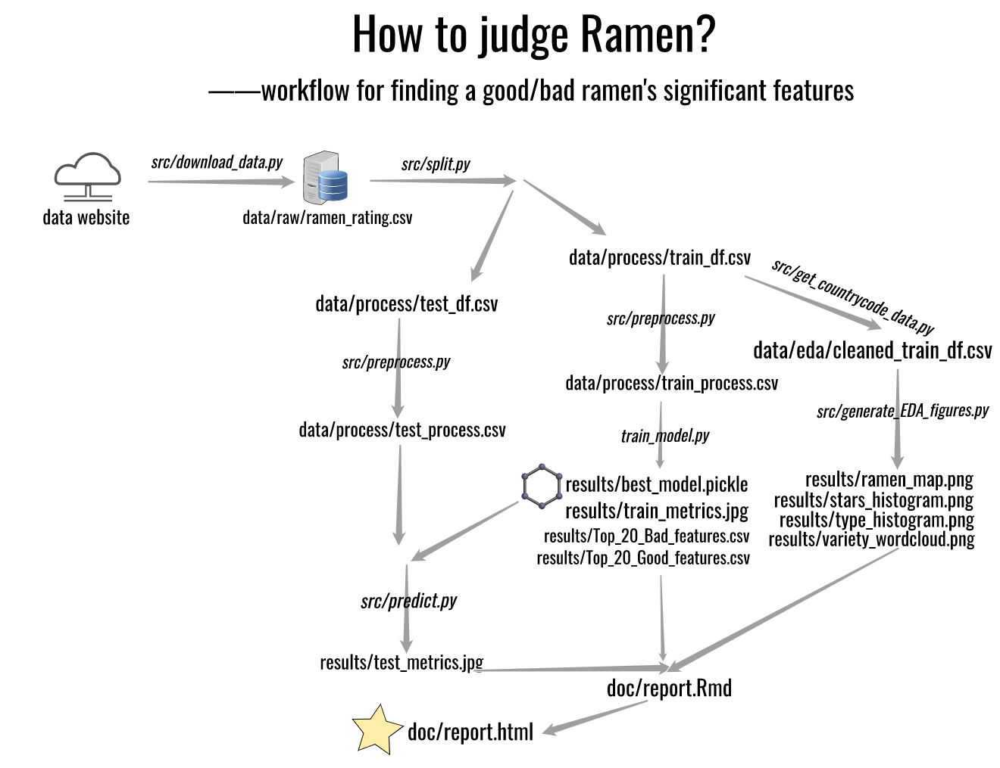

# Ramen Star Prediction

**Contributors:**

This is a project for MDS 522 Group6.

  - Allyson Stoll
  - Irene Yan
  - Wenjia Zhu
  - Xiaohan Chen

## Summary

  In this project, we explored the world of instant noodles, aka ramen with a dataset containing over 2500 reviews on all kinds of instant noodles. The main problem we try to solve is to find what features are important for predicting a ramen’s rating. We used the OneHotEncoder(), CountVector() to transform the data. With the logistic regression model, we finally get an AUC score of 0.722 on the test dataset and summarize the top 5 good features and also top 5 bad features in our report. This is not a big question, but it is a good start of figuring out a result in real-life problems with data science for us. Considering the usefulness of this model for food lovers around the world when choosing nearby ramen restaurants, we think this is a very interesting and meaningful question.

### Dataset
The dataset we used in this project is downloaded from an data analysist called Aleksey Bilogur.  Each record in the dataset is a single ramen product review. It is updated as of September 22nd, 2021. Current as of review #3950.
reviews are based on personal preferences, not on sales of popularity.
Scores are in .25 increments – rounding is NOT recommended. Think of letter
grading; a 3.5 score out of 5 stars – (3.5 * 2) * 10 = 70 = C.

## Report
The final report can see here: [Report](https://github.com/PANDASANG1231/522_Ramen/blob/main/doc/report.html)

## Usage

We use python in this project and the workflow and orders of using scripts is as below:

## Dependencies

The dependencies is listed in the environment.yaml, which you can find [here](https://raw.githubusercontent.com/PANDASANG1231/522_Ramen/main/environment.yaml).

## License

The source code for the site is licensed under the MIT license, which you can find [here](https://raw.githubusercontent.com/PANDASANG1231/522_Ramen/main/LICENSE).

## References

Updated as of September 22nd, 2021. Current as of review #3950.
reviews are based on personal preferences, not on sales of popularity.
Scores are in .25 increments – rounding is NOT recommended. Think of letter
grading; a 3.5 score out of 5 stars – (3.5 * 2) * 10 = 70 = C.
 <https://www.theramenrater.com/resources-2/the-list/>.

Ramen (ラーメン) is a noodle soup dish that was originally imported from China
 and has become one of the most popular dishes in Japan in recent decades.
Ramen are inexpensive and widely available, two factors that also make them 
an ideal option for budget travelers. Ramen restaurants, or ramen-ya, can 
be found in virtually every corner of the country and produce countless regional 
variations of this common noodle dish.
<https://www.japan-guide.com/e/e2042.html>.

